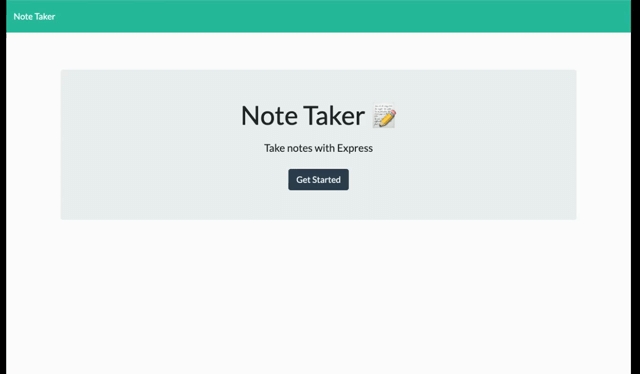

# Note Taker

Take some notes with [Note Taker](https://note-uclabcs-11.herokuapp.com/)




## Intro

Note Taker is a simple web app to quickly create, save, and delete notes. Notes consist of Title and Body. Note data is stored natively in db.json.

## Usage 
Any one can use the live deployment, but notes can be viewed/deleted by anyone. If you wish to use the app privately, view Installation.

## Installation
Fork this repository.
```
$ git clone https://github.com/joe-zu/11-Notes.git
```
Use the app on LocalHost or create a new heroku project.
```
$ heroku create <app_name_you_want_it_to_be>
```
see [heroku documentation](https://devcenter.heroku.com/articles/getting-started-with-nodejs#set-up) for more

## Thank you